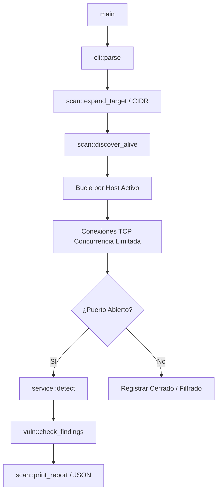
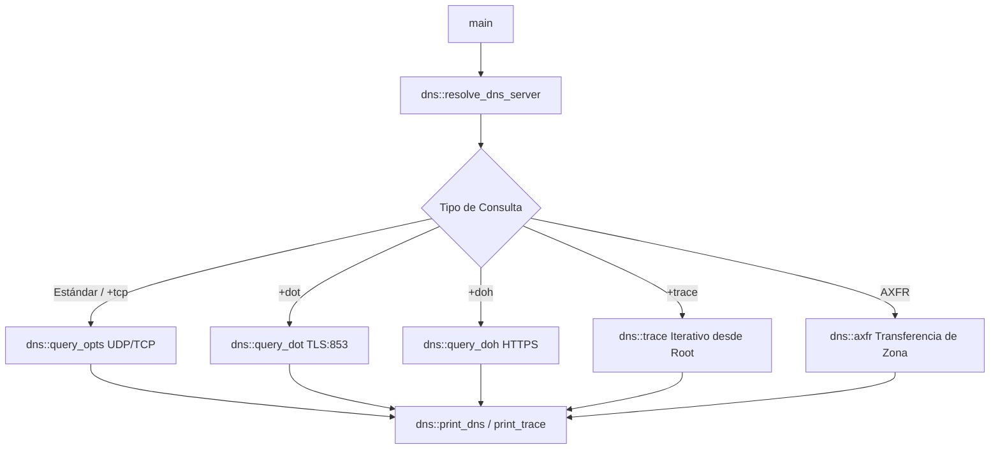

# Arquitectura de Kaisen

Este documento describe la arquitectura interna, diseño del sistema y flujo de datos de **Kaisen**. Su propósito es servir como mapa técnico para colaboradores y desarrolladores.

---

## 1. Visión General del Sistema

Kaisen es una herramienta de auditoría y reconocimiento de red diseñada para ser **rápida, modular y completamente funcional sin privilegios de root (`CAP_NET_RAW` / superusuario)**. Combina capacidades de escaneo de puertos tipo Nmap con resolución avanzada de DNS y auditoría tipo Dig.

### Principios Fundamentales de Diseño
1. **Sin Root (Unprivileged by Design)**: No requiere privilegios de administrador. Todas las operaciones de red se ejecutan a nivel de sockets estándar en espacio de usuario.
2. **Cero Dependencias Pesadas**: Solo se utilizan 3 dependencias externas (`tokio`, `futures`, `socket2`). No se usan crates pesados de TLS o HTTP; los handshakes y protocolos se implementan directamente.
3. **Liberación Inmediata de Recursos (`SO_LINGER=0`)**: Para evitar saturar tablas conntrack de routers y firewalls durante escaneos rápidos (`-sV`), los sockets se resetean inmediatamente con TCP RST al cerrarse.
4. **Binario Autocontenido**: Todos los conjuntos de datos (top ports, firmas de vulnerabilidad y CVEs) están compilados e incrustados directamente en el binario.

---

## 2. Mapa de Módulos y Responsabilidades

```
src/
├── main.rs                 # Punto de entrada y dispatching por modo de ejecución
├── cli/                    # Parser de argumentos CLI y configuración
│   └── mod.rs              # Tokenización personalizada, gestión de modos y Timing (T0-T5, -HS)
├── scan/                   # Orquestación de escaneo de red
│   ├── mod.rs              # scan_host, discover_alive, renderizado de resultados (texto/JSON)
│   ├── osfp.rs             # Fingerprinting de sistema operativo (TTL, banners, ARP)
│   ├── udp.rs              # Escaneo de puertos UDP y heurísticas de sondeo
│   ├── neigh.rs            # Reconocimiento de vecinos e infraestructura de red
│   └── mail.rs             # Auditoría de registros y servidores de correo (MX, SPF, DKIM, DMARC)
├── dns/                    # Subsistema de resolución y auditoría DNS
│   ├── mod.rs              # Protocolo DNS sobre UDP/TCP, DoT (DNS over TLS), DoH y AXFR
│   ├── nsaudit.rs          # Auditoría de servidores de nombres (delegación, coherencia)
│   └── whois.rs            # Cliente WHOIS nativo
├── service/                # Detección e identificación de servicios
│   ├── mod.rs              # Detección en 3 niveles (Listen, Probe, Fallback) y ServiceInfo
│   ├── probe.rs            # Handshakes binarios (SMB, TDS/MSSQL, MongoDB, Redis, Postgres, etc.)
│   └── web.rs              # Fingerprinting HTTP/HTTPS y extracción de títulos/cabeceras
├── vuln/                   # Detección heurística de vulnerabilidades
│   ├── mod.rs              # Motor de matching de firmas de vulnerabilidad (Signature Engine)
│   └── cve.rs              # Base de datos embebida de CVEs correlacionados por producto y versión
├── ports/                  # Datasets y conjuntos de puertos
│   └── mod.rs              # TOP_PORTS (nmap 1000 + extras), puertos UDP y sondas
├── tls/                    # Implementación ligera de TLS en espacio de usuario
│   ├── mod.rs              # Parser y handshake básico de TLS 1.2 y certificados X.509
│   └── tls13.rs            # Handshake y cifrado ligero TLS 1.3
└── util/                   # Utilidades compartidas
    ├── mod.rs              # Re-export de utilidades
    ├── output.rs           # Painter (gestión de colores ANSI) y serialización JSON
    └── netutil.rs          # reset_on_close y manipulación de socket2
```

---

## 3. Flujos de Ejecución Principales

### A. Flujo de Escaneo de Puertos (`Mode::Scan`)


1. **Expansión**: Convierte nombres de dominio, direcciones IP o bloques CIDR en una lista concreta de IPs.
2. **Descubrimiento (`discover_alive`)**: Realiza un barrido ultra rápido para determinar si los hosts están activos antes de proceder al escaneo completo.
3. **Escaneo de Puertos**: Ejecuta conexiones concurrentes reguladas por la plantilla de `Timing` seleccionada (T0 a T5 o `-HS`).
4. **Detección de Servicios (`service`)**:
   - *Fase 1 (Listen)*: Escucha banners espontáneos (SSH, SMTP, FTP...).
   - *Fase 2 (Probe)*: Envía sondas específicas según el número de puerto (HTTP, SMB, Redis, etc.).
   - *Fase 3 (Fallback)*: Prueba HTTP/TLS en puertos genéricos.
5. **Correlación de Vulnerabilidades (`vuln`)**: Cruza el producto y versión detectados con el catálogo heurístico de firmas CVE embebido.
6. **Emisión de Resultados**: Imprime la tabla interactiva o la salida estructurada en JSON.

---

### B. Flujo de Resolución DNS (`Mode::Dns`)


---

## 4. Guía de Extensibilidad para Nuevos Desarrolladores

- **Agregar nuevo protocolo a detección de servicios**: Implementa la sonda en [`src/service/probe.rs`](src/service/probe.rs) y añade el caso de mapeo en `service::run_binary` dentro de [`src/service/mod.rs`](src/service/mod.rs).
- **Agregar firmas de vulnerabilidades**: Edita `SIGNATURES` en [`src/vuln/mod.rs`](src/vuln/mod.rs) o `CVE_DB` en [`src/vuln/cve.rs`](src/vuln/cve.rs).
- **Agregar soporte para nuevos registros DNS**: Agrega la definición en `type_to_num` y `parse_rdata` en [`src/dns/mod.rs`](src/dns/mod.rs).
