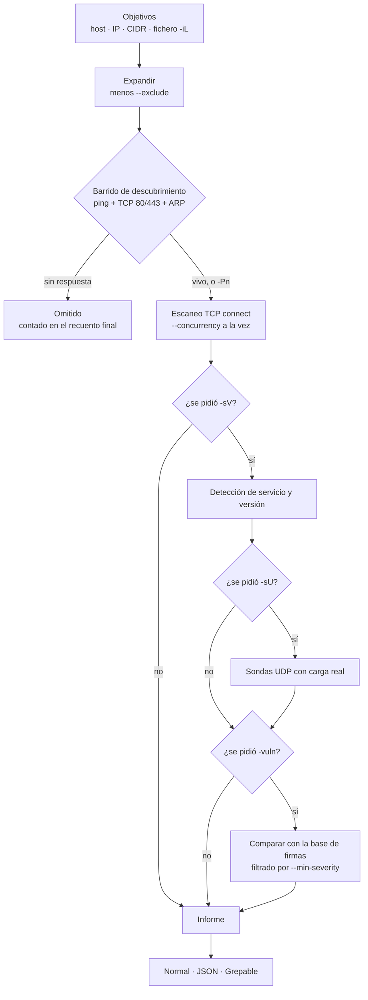
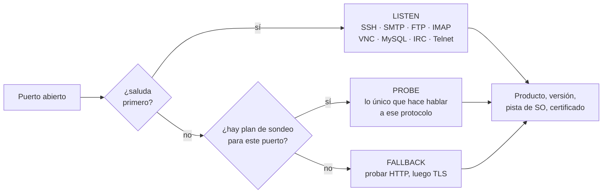

**Un escáner de puertos y un juego de herramientas DNS en un solo binario. Sin root. Sin dependencias.**

[Instalación](#instalación) · [Empezar](#empezar) · [Comandos](#referencia-de-comandos) ·
[Cómo funciona](#cómo-se-ejecuta-un-escaneo) · [DNS cifrado](#dns-cifrado) ·
[English](README.md)

</div>

---

Kaisen es un único binario autocontenido que instalas una vez y ejecutas desde
cualquier sitio (`kaisen`, `kai` o `kaison`). Combina **escaneo de puertos** a
alta velocidad, **detección de servicio y versión**, **inferencia del sistema
operativo**, un **comparador de firmas de vulnerabilidades** y un **resolutor DNS**
completo — un sustituto de `dig` que además habla DNS cifrado — sobre un motor
asíncrono que escanea miles de puertos a la vez.

> [!NOTE]
> **No hace falta root.** El motor usa escaneos TCP `connect()` sin privilegios,
> así que Kaisen funciona igual en un **Termux sin rootear**, en **Kali**, en
> cualquier Linux o en macOS. Lo que normalmente exige sockets en crudo (escaneo
> SYN `-sS`, ping ICMP, huella TCP/IP del sistema operativo) se degrada con un
> aviso claro en vez de fallar.


---

## ▍Por qué Kaisen

<dl>

<dt>Rápido, y sin pedir privilegios</dt>
<dd>Rust y <code>tokio</code> empujan miles de conexiones simultáneas. Un barrido
completo de los 65.535 puertos de un host local termina en un par de
segundos.</dd>

<dt>Dos herramientas en una</dt>
<dd>Escaneo de puertos y servicios <em>y</em> resolución DNS, con los flags que ya
conoces de <code>nmap</code> y <code>dig</code>.</dd>

<dt>Escrito desde cero, de arriba abajo</dt>
<dd>El motor DNS, el sondeador TLS, el cliente TLS 1.3, el cliente WHOIS y cada
sonda de protocolo están implementados aquí. Las únicas dependencias son
<code>tokio</code> y <code>futures</code>. Los conjuntos de puertos (más de 800
con nombre) y la base de vulnerabilidades van embebidos en el binario.</dd>

<dt>Honesto sobre sus límites</dt>
<dd>Donde una herramienta sin privilegios no puede saber algo, Kaisen lo dice en
tiempo de ejecución en lugar de adivinar y presentar la suposición como un
hecho.</dd>

</dl>

---

## ▍Instalación

**Linux / macOS / Termux**
```sh
curl -fsSL https://raw.githubusercontent.com/nostraxiten/kaisen/main/install.sh | sh
```

**Windows (PowerShell)**
```powershell
irm https://raw.githubusercontent.com/nostraxiten/kaisen/main/install.ps1 | iex
```

El instalador detecta tu sistema, instala una cadena de herramientas de Rust si
hace falta, compila el binario de release y deja `kaisen` / `kai` / `kaison` en
un directorio de tu `PATH` — prefiriendo uno con permiso de escritura para tu
usuario, así que **no necesitas admin/sudo**.

<details>
<summary><b>Termux, desde el código y otras plataformas</b></summary>

<br>

**Termux (sin rootear)**

```sh
pkg install -y git rust
git clone https://github.com/nostraxiten/kaisen
cd kaisen && ./install.sh
```

**Desde el código, en cualquier sistema**

```sh
git clone https://github.com/nostraxiten/kaisen
cd kaisen
cargo build --release
# el binario queda en target/release/kaisen
```

Probado en Windows, Termux (sin rootear), Kali, Debian/Ubuntu, Arch, Fedora, Alpine y
macOS. Se publican binarios de release para Linux x86-64/aarch64 (musl), Android
aarch64 y macOS Intel/Apple Silicon.

</details>

---

## ▍Empezar

```console
$ kaisen -sV 10.0.0.5                    # versiones en los 1000 puertos top
$ kaisen -A scanme.example.com           # versiones + SO + vulnerabilidades
$ kaisen -PA --progress 10.0.0.5         # los 65535 puertos, viendo el avance
$ kaisen -iL hosts.txt --exclude 10.0.0.1    # una lista, menos la puerta de enlace
$ kaisen -HS -PA --open scanme.example.com   # lo más rápido, solo lo abierto

$ kaisen dns MX example.com @8.8.8.8     # DNS, al estilo dig
$ kaisen dns +dot A example.com          # lo mismo, cifrado sobre TLS 1.3
$ kaisen mail paypal.com                 # auditoría completa del correo
$ kaisen ns example.com                  # salud y exposición de los servidores DNS
```

> [!TIP]
> `kaisen --help` imprime una pantalla, no un muro. Pide un tema cada vez:
> `--help scan`, `--help dns`, `--help udp`, `--help timing`, `--help examples`,
> y `--help all` para la referencia completa.

---

## ▍Cómo se ejecuta un escaneo

Kaisen trabaja en dos fases, como `nmap`: primero una comprobación barata de
vida para todos, de modo que el barrido caro de puertos solo se ejecute contra
los hosts que han contestado algo.



---

## ▍Referencia de comandos

Todos los flags de abajo están también en `kaisen --help`, agrupados igual.

<details>
<summary><b>Tipo de escaneo y descubrimiento de hosts</b></summary>

<br>
<dl>

<dt><code>-sT</code> &nbsp;<sub><code>--connect</code></sub></dt>
<dd>Escaneo TCP <code>connect()</code>. El predeterminado, y la razón de que no
haga falta root.</dd>

<dt><code>-sS</code> &nbsp;<sub><code>--syn</code></sub></dt>
<dd>Escaneo SYN semiabierto. Necesita sockets en crudo; si no están disponibles
cae a <code>-sT</code> con un aviso.</dd>

<dt><code>-sU</code> &nbsp;<sub><code>--udp</code></sub></dt>
<dd>Escaneo UDP con cargas útiles por protocolo. Sigue sin necesitar root — ver
<a href="#escaneo-udp">escaneo UDP</a>.</dd>

<dt><code>-Pn</code> &nbsp;<sub><code>--no-ping</code></sub></dt>
<dd>Salta el descubrimiento y da por vivo todo objetivo. Úsalo cuando ICMP y los
puertos 80/443 están filtrados pero sabes que el host está ahí.</dd>

</dl>
</details>

<details>
<summary><b>Elegir objetivos</b></summary>

<br>
<dl>

<dt><code>&lt;objetivo&gt;</code></dt>
<dd>Nombre de host, IPv4, IPv6 o CIDR IPv4 hasta <code>/16</code>. Un nombre de
host se escanea en su dirección principal.</dd>

<dt><code>-iL &lt;fichero&gt;</code> &nbsp;<sub><code>--target-file</code></sub></dt>
<dd>Lee los objetivos de un fichero: uno por línea, <code>#</code> inicia un
comentario y las líneas vacías se ignoran. Con <code>-</code> lee la entrada
estándar, así que una tubería puede alimentar la lista directamente.</dd>

<dt><code>--exclude &lt;lista&gt;</code></dt>
<dd>Hosts, nombres o CIDR separados por comas que hay que dejar en paz, aunque
un objetivo CIDR los contenga: la puerta de enlace, la impresora, una dirección
fuera de alcance. Excluir un nombre de host quita <em>todas</em> las direcciones
a las que resuelve.</dd>

<dt><code>--exclude-file &lt;fichero&gt;</code></dt>
<dd>La misma lista, leída de un fichero.</dd>

<dt><code>-4</code> / <code>-6</code></dt>
<dd>Forzar IPv4 o IPv6.</dd>

</dl>
</details>

<details>
<summary><b>Elegir puertos</b></summary>

<br>
<dl>

<dt><code>-PF</code> &nbsp;<sub><code>--port-famous</code></sub></dt>
<dd>Los 1000 puertos TCP más conocidos. Es lo predeterminado.</dd>

<dt><code>-PA</code> &nbsp;<sub><code>--ports-all</code> · <code>-p-</code></sub></dt>
<dd>Todos los puertos TCP, del 1 al 65535.</dd>

<dt><code>-F</code> &nbsp;<sub><code>--fast</code></sub></dt>
<dd>Los 100 puertos TCP más comunes.</dd>

<dt><code>-p &lt;spec&gt;</code> &nbsp;<sub><code>--ports</code></sub></dt>
<dd>Lista y rangos explícitos: <code>-p 22,80,443,8000-8100</code>.</dd>

<dt><code>--top-ports &lt;n&gt;</code></dt>
<dd>Los N puertos TCP más conocidos.</dd>

<dt><code>-pU &lt;spec&gt;</code> &nbsp;<sub><code>--udp-ports</code></sub> ·
<code>--top-udp &lt;n&gt;</code></dt>
<dd>Puertos UDP explícitos o los N primeros. Cualquiera de los dos implica
<code>-sU</code>; con un <code>-sU</code> a secas el valor por defecto son los
40 primeros.</dd>

<dt><code>--exclude-ports &lt;spec&gt;</code></dt>
<dd>Quita puertos de la selección que hayas hecho: se aplica al final, así que
resta igual de <code>-p</code>, <code>-PF</code>, <code>-PA</code> y
<code>--top-ports</code>, y también de la lista UDP. Útil para los puertos que
alteran a equipos frágiles.</dd>

</dl>
</details>

<details>
<summary><b>Detección</b></summary>

<br>
<dl>

<dt><code>-sV</code> &nbsp;<sub><code>--service-version</code></sub></dt>
<dd>Identifica el servicio y la versión en cada puerto abierto. Ver
<a href="#detección-de-servicio-y-versión">cómo funciona</a>.</dd>

<dt><code>-OS</code> &nbsp;<sub><code>--os-detection</code> · <code>-O</code></sub></dt>
<dd>Infiere el sistema operativo. Usado <em>solo</em> imprime un informe centrado
en el SO en vez de una tabla de puertos; combinado con un escaneo añade una
línea de SO.</dd>

<dt><code>-MC</code> &nbsp;<sub><code>--mac</code></sub></dt>
<dd>Dirección MAC de la caché ARP local. Solo se puede resolver en una subred
conectada directamente.</dd>

<dt><code>-DP</code> &nbsp;<sub><code>--device</code></sub></dt>
<dd>Adivina el tipo de dispositivo: móvil, cámara, televisor, consola,
impresora, NAS, router.</dd>

<dt><code>-WW</code> &nbsp;<sub><code>--webscan</code></sub></dt>
<dd>Fingerprint web en cada puerto HTTP/HTTPS abierto, estilo <code>whatweb</code>
pero pasivo — unos pocos GET, siguiendo redirects (apex→www incluido). Informa
del CMS / framework / servidor y su versión (WordPress, Drupal, Next.js,
Laravel, nginx, IIS…), el WAF y CDN por delante (Cloudflare, Akamai, Sucuri,
Fastly…), el título de la página, una nota de cabeceras de seguridad (HSTS, CSP,
X-Frame-Options y tres más, A+…F), y un <b>hash de favicon compatible con
Shodan</b> para pivotar. Implica <code>-sV</code>. Todo aparece también en
<code>-oJ</code>, en el objeto <code>web</code> de cada puerto.</dd>

<dt><code>-vuln</code> &nbsp;<sub><code>--vuln</code></sub></dt>
<dd>Compara lo encontrado con la base de firmas embebida.</dd>

<dt><code>-A</code> / <code>-AA</code></dt>
<dd><code>-A</code> es <code>-sV</code> + <code>-OS</code> + <code>-vuln</code>.
<code>-AA</code> añade <code>-sU</code>, <code>-MC</code> y <code>-DP</code>; es
más lento, porque UDP espera timeouts que TCP nunca paga.</dd>

<dt><code>-FW</code> &nbsp;<sub><code>--firewall</code></sub></dt>
<dd>Comprobación previa de firewall / middlebox. Antes de tocar los puertos
reales, Kaisen prueba <b>tres puertos altos al azar</b> (6000–60000). Si el host
responde <b>los tres</b> como <code>open</code>, algo está completando cada
handshake sin importar qué haya escuchando —un firewall o el router del ISP—, así
que cualquier lista de puertos sería falsa: Kaisen se detiene de inmediato y lo
avisa en amarillo. Si esos puertos salen cerrados o filtrados, el host es
realmente escaneable y el escaneo normal continúa. <code>-FW</code> es además lo
que activa el aviso «un handshake completado no prueba nada aquí»; sin la flag,
Kaisen simplemente informa de lo que respondió y no se mete en medio.</dd>

</dl>
</details>

<details>
<summary><b>Ritmo, velocidad y progreso</b></summary>

<br>
<dl>

<dt><code>-T0</code> … <code>-T5</code></dt>
<dd>Plantilla de tiempos, de paranoica a demencial. <code>-T3</code> es la
predeterminada.</dd>

<dt><code>-HS</code> &nbsp;<sub><code>--hyper-speed</code></sub></dt>
<dd>Concurrencia máxima, timeouts mínimos.</dd>

<dt><code>--concurrency &lt;n&gt;</code> · <code>--timeout &lt;ms&gt;</code> ·
<code>--retries &lt;n&gt;</code></dt>
<dd>Ajusta piezas concretas de la plantilla. Un valor explícito siempre gana a
<code>-T</code> y a <code>-HS</code>.</dd>

<dt><code>--scan-delay &lt;ms&gt;</code></dt>
<dd>Pausa entre hosts. Más amable con la red, y más discreto ante lo que la esté
vigilando.</dd>

<dt><code>--max-rate &lt;n&gt;</code></dt>
<dd>Limita las conexiones nuevas por segundo (<code>0</code> = sin límite). Es la
perilla que evita que un barrido grande desborde el router de casa y lo haga
descartar todos los paquetes — el fallo donde un host alcanzable sale con
<b>0 abiertos</b>. Por defecto según plantilla: <code>-T3</code> 50,
<code>-T4</code> 150, <code>-T5</code>/<code>-HS</code> sin límite. Súbelo en una
red rápida, bájalo en una frágil. <code>-T4</code> y <code>-T5</code> son más
rápidas que el default, pero solo <code>-T3</code>/<code>-T4</code> siguen siendo
seguras a través de NAT — <code>-T5</code> es para una LAN o lab sin firewall con
estado en el camino.</dd>

<dt><code>--progress</code> · <code>--stats-every &lt;s&gt;</code></dt>
<dd>Ajusta la cadencia de refresco del progreso (cada dos segundos, o cada N).
Rara vez lo necesitas: un contador en vivo (hechos/total, %, tasa, ETA) <b>se
activa solo</b> en cualquier escaneo que te haga esperar, en todos los formatos
de salida. Usa esto solo para cambiar cada cuánto se refresca.</dd>

</dl>

> [!TIP]
> El progreso se escribe en **stderr**, y solo cuando stderr es un terminal — así
> aparece también en modo JSON y grepable, mientras los datos de **stdout** quedan
> limpios. Redirigir a un fichero, pasar por `jq` o ejecutar en CI lo quita
> automáticamente.

</details>

<details>
<summary><b>Salida y filtrado</b></summary>

<br>
<dl>

<dt><code>--open</code></dt>
<dd>Muestra solo los puertos abiertos.</dd>

<dt><code>--no-stream</code></dt>
<dd>Por defecto, Kaisen imprime cada puerto abierto <b>en vivo</b> por stderr en
cuanto lo confirma, para que en un escaneo grande leas los resultados según van
llegando en vez de esperar al final (<code>OPEN → mostrar → seguir
escaneando</code>). Mientras drenan los puertos restantes (normalmente
filtered), un contador en vivo <code>hechos/total · % · ritmo · ETA</code> se
actualiza por stderr, para que el escaneo nunca parezca colgado. El informe
completo y ordenado se imprime igualmente al terminar. <code>--no-stream</code>
desactiva el feed en vivo. El streaming solo aplica a la salida legible en un
terminal; JSON y grepable siempre emiten un documento completo.</dd>

<dt><code>--reason</code></dt>
<dd>Muestra por qué cada puerto está en el estado en que está:
<code>syn-ack</code>, <code>conn-refused</code>, <code>timeout</code>.</dd>

<dt><code>--min-severity &lt;nivel&gt;</code></dt>
<dd>Oculta los hallazgos de <code>-vuln</code> por debajo de <code>info</code>,
<code>low</code>, <code>medium</code>, <code>high</code> o
<code>critical</code>. La detección se sigue ejecutando entera: esto filtra el
informe, JSON incluido, y una línea final dice cuántos hallazgos se
ocultaron.</dd>

<dt><code>--vuln-list</code></dt>
<dd>Imprime todas las reglas que <code>-vuln</code> puede disparar —firmas,
exposición por puerto, condiciones de sonda— y termina. Sin tráfico de red y sin
necesidad de objetivo. Respeta <code>--min-severity</code>.</dd>

<dt><code>-v</code>, <code>-vv</code>, <code>-vvv</code></dt>
<dd>Más detalle. <code>-vv</code> despliega cada hallazgo de vulnerabilidad.</dd>

<dt><code>-oN</code> / <code>-oJ</code> / <code>-oG</code></dt>
<dd>Salida normal, JSON o grepable.</dd>

<dt><code>--color</code> / <code>--no-color</code></dt>
<dd>Fuerza el color. Se respeta <code>NO_COLOR</code>, y el color se apaga solo
cuando la salida no es un terminal.</dd>

<dt><code>-h [tema]</code> &nbsp;<sub><code>--help</code></sub></dt>
<dd>El resumen, una sección concreta, o <code>--help all</code> para todo.</dd>

</dl>
</details>

---

## ▍Detección de servicio y versión

`-sV` no se limita a capturar un banner. Kaisen ejecuta un plan de sondeo por
puerto en tres niveles, del más barato al más caro, y para en cuanto algo se
identifica.



Como los servidores con hosting virtual responden a una IP pelada con una página
genérica, Kaisen envía el nombre que realmente pediste como cabecera `Host` de
HTTP y como SNI de TLS.

<details>
<summary><b>Los protocolos que Kaisen habla para sacar una versión</b></summary>

<br>

| Protocolo | Qué se obtiene |
|---|---|
| **TLS/SSL** | versión negociada, cifrado, ALPN, CN del certificado, emisor, nombres SAN, caducidad — desde un ClientHello hecho a mano |
| **SMB2** | el dialecto, y con él la generación de Windows, más la política de firma |
| **MS SQL Server** | la build exacta: `15.0.2000` es SQL Server 2019 |
| **MongoDB** | la versión por `maxWireVersion`, y la exacta si no exige autenticación |
| **Oracle** | `VSNNUM` decodificado a `11.2.0.4.0` |
| **PostgreSQL** | si soporta TLS y qué método de autenticación exige |
| **RDP** | la capa de seguridad (con NLA o sin él) y el nombre de la máquina del certificado |
| **AMQP** | propiedades de `connection.start`: RabbitMQ y su versión exacta |
| **Kafka** | el mapa de APIs, y de ahí una versión aproximada del broker |
| **Cassandra** | versión de CQL soportada |
| **LDAP** | AD u OpenLDAP, el nombre del DC, los contextos de nombres |
| **DNS** | `version.bind`: BIND, PowerDNS, Unbound o dnsmasq, y la versión |
| **MQTT** | versión del broker, y si acepta conexiones anónimas |
| **X11** | versión del protocolo, fabricante, y si el control de acceso está desactivado |
| **epmd** | cada nodo Erlang registrado y su puerto de distribución |
| **Minecraft** | versión del servidor, protocolo, número de jugadores |
| **AJP13** | conector alcanzable — la precondición de Ghostcat |
| **SOCKS** | versión, y si es un proxy abierto |
| **Redis · memcached · ZooKeeper** | versión, y si exige autenticación |
| **HTTP** | `Server`, `X-Powered-By`, `X-Jenkins`, `<title>`, APIs JSON de versión |

La detección HTTP además identifica aplicaciones y dispositivos por cabeceras,
cookies, marcadores del cuerpo y nombres de certificado — WordPress, Jenkins,
GitLab, Grafana, Kibana, Proxmox, pfSense, Synology, Home Assistant, MikroTik,
impresoras, cámaras — y lee versiones de las raíces JSON de Elasticsearch, etcd,
Docker, Consul, Vault y Kibana.

Detrás hay **1.055 filas de huellas que nombran 973 productos distintos**, la
mayoría convertidas de la base `nmap-service-probes` de Nmap:

| Tabla | Filas | Qué lee |
|---|---:|---|
| `APP_MARKERS` | 288 | palabras clave en cualquier parte de la respuesta: cookies (`webvpn=`, `cprelogin=`, `grafana_sess=`), realms de autenticación, marcadores del cuerpo, nombres de certificado, banners de telnet |
| `SERVER_ALIASES` | 480 | cabeceras `Server:` cuyo primer token *no* es el producto — `Apache-Coyote/1.1` es el conector de Tomcat, `App-webs/` es una cámara Hikvision, `Cougar/9.01` es Windows Media Services |
| `SSH_SOFTWARE` | 139 | la cadena de software de `SSH-2.0-…`, para las pilas de fabricante donde partir por `_` da un resultado erróneo |
| `MAIL_PRODUCTS` | 85 | saludos y listas de capacidades de SMTP/POP3/IMAP |
| Demonios FTP | 63 | el saludo `220` |

Nada de esto es un barrido con regex: cada tabla está acotada al único sitio
donde vive su evidencia (la cabecera `Server:`, el saludo SSH, la línea 220), y
eso es lo que le permite ser grande sin inventarse productos. Un servidor que se
nombra bien a sí mismo —nginx, Apache, IIS, lighttpd, WebSphere, GlassFish— no
se renombra nunca, y hay un test que lo comprueba.

</details>

```console
$ kaisen -sV example.com
443/tcp  open  https   TLS 1.3 (CN=example.com; issuer=R11; expires 2026-09-06; ALPN=h2)
```

---

## ▍Escaneo UDP

UDP es donde se paran casi todos los escáneres, porque no hay handshake en el
que apoyarse. Kaisen consigue una respuesta real por dos vías, ambas sin root.

<dl>

<dt>Una respuesta significa abierto</dt>
<dd>Cada puerto que merece la pena escanear recibe una carga que el servicio va a
contestar de verdad: un paquete de cliente NTP, un GET de SNMP, un node status
de NetBIOS, un <code>A2S_INFO</code> de Steam. Un datagrama vacío genérico no
prueba nada; uno con forma de protocolo identifica el servicio en el mismo viaje
de ida y vuelta.</dd>

<dt>Un ICMP port-unreachable significa cerrado</dt>
<dd>Kaisen nunca ve el paquete ICMP — eso exige <code>CAP_NET_RAW</code> — pero un
socket UDP <em>conectado</em> lo hace aflorar como <code>ConnectionRefused</code>
en la siguiente recepción. Eso es lo que permite separar cerrado de filtrado sin
privilegio alguno.</dd>

</dl>

> [!IMPORTANT]
> El silencio se informa como `open|filtered`, nunca como una cosa o la otra. Un
> descarte del cortafuegos y un servicio callado son genuinamente
> indistinguibles desde fuera, y Kaisen no va a adivinar entre los dos.

<details>
<summary><b>Qué traen de vuelta las sondas UDP</b></summary>

<br>

| Sonda | Qué se obtiene |
|---|---|
| **NTP**, preguntado de tres formas | estrato y reloj de referencia; la versión exacta del demonio y el SO del host vía `readvar` de modo 6; y `monlist`, cuya respuesta *es* el hallazgo CVE-2013-5211 |
| **NetBIOS** node status | nombre de host, grupo de trabajo, roles por nombre, MAC del adaptador |
| **SQL Server Browser** | cada instancia con su versión exacta y su puerto TCP, sin autenticar |
| **IPMI** | versión, y si se permite autenticación nula o inicio de sesión anónimo |
| **SNMP** v1/v2c/v3 | `sysDescr`, que suele ser la cadena completa del SO |
| **EtherNet/IP** | fabricante, nombre de producto, revisión de firmware, número de serie |
| **rpcbind** | cada programa RPC registrado con su versión y su puerto |
| También | DNS, SSDP/UPnP, mDNS, LLMNR, IKE, STUN, CoAP, TFTP, XDMCP, memcached, BACnet, DNP3, RakNet, Steam, Mumble, Ubiquiti, SLP, RIP, OpenVPN |

</details>

```console
$ kaisen -sU 192.168.1.1                  # los 40 puertos UDP top
$ kaisen -sU -pU 123,161,1900 10.0.0.5    # servicios concretos
$ kaisen -AA 192.168.1.10                 # TCP + UDP + SO + vuln, todo
```

---

## ▍DNS

El subcomando `dns` (también `dig` o `resolve`) es un resolutor completo, no un
envoltorio del resolutor del sistema. Habla con el servidor que le nombres, por
el transporte que elijas, y te enseña lo que ha llegado.

<details>
<summary><b>Opciones de consulta</b></summary>

<br>
<dl>

<dt><code>-D &lt;tipo&gt;</code> &nbsp;<sub><code>--dns</code></sub></dt>
<dd>Tipo de registro — o escríbelo como una palabra suelta, al estilo dig:
<code>kaisen dns MX example.com</code>. Entiende A AAAA NS CNAME SOA PTR MX TXT
SRV CAA NAPTR SVCB HTTPS TLSA SSHFP DS DNSKEY CDS CDNSKEY RRSIG NSEC NSEC3 CERT
DNAME URI HINFO LOC KX EUI48 EUI64 ZONEMD OPENPGPKEY SMIMEA AXFR ANY, y
<code>TYPE###</code> para cualquier otro.</dd>

<dt><code>-x &lt;ip&gt;</code> &nbsp;<sub><code>--reverse</code></sub></dt>
<dd>Búsqueda inversa (PTR).</dd>

<dt><code>@servidor</code> · <code>--dns-port &lt;n&gt;</code></dt>
<dd>Pregunta a un servidor concreto, en un puerto concreto.</dd>

<dt><code>+short</code> · <code>+tcp</code> · <code>+ttl</code> · <code>+all</code></dt>
<dd>Solo las respuestas; forzar TCP; mostrar los TTL; imprimir también las
secciones de autoridad y adicionales.</dd>

<dt><code>+dnssec</code> · <code>+nsid</code> · <code>+norec</code></dt>
<dd>Activa el bit DO y muestra RRSIG/DNSKEY; pregunta qué nodo anycast ha
contestado (RFC 5001); limpia RD para pedirle a un servidor sus propios datos en
vez de una recursión.</dd>

<dt><code>+trace</code></dt>
<dd>Resuelve iterativamente desde la raíz, un salto de delegación por bloque —
así una delegación rota aparece como el salto donde la cadena se detiene, y no
como un SERVFAIL a secas.</dd>

<dt><code>+subnet &lt;cidr&gt;</code></dt>
<dd>EDNS Client Subnet (RFC 7871): pregunta como si estuvieras en esa red, y
muestra el <em>scope</em> que el servidor ha usado para responder. Así se ve
desde una sola máquina cómo un CDN reparte el tráfico por regiones. Los bits de
host se ponen a cero antes de enviar, como exige el RFC.</dd>

</dl>

EDNS0 se anuncia por defecto (carga de 1232 bytes, según el DNS Flag Day 2020),
con un reintento automático sin él para los servidores demasiado antiguos.
Pedir `AXFR` realiza una transferencia de zona e informa de si se ha permitido.

</details>

### DNS cifrado

`+dot` envía la consulta por TLS 1.3 en el puerto 853 (RFC 7858). `--doh` la
envía por HTTPS (RFC 8484). En ambos casos la red en la que estás no puede leer
la pregunta ni reescribir la respuesta.

```console
$ kaisen dns +dot A example.com                    # vía one.one.one.one
$ kaisen dns +dot A example.com @dns.google
$ kaisen dns --doh MX example.com                  # vía cloudflare-dns.com
$ kaisen dns --doh https://dns.quad9.net/dns-query A example.com
```

El cliente TLS está escrito desde cero como todo lo demás: X25519 para el
intercambio de claves, ChaCha20-Poly1305 o AES-128-GCM para los registros y
SHA-256 en todo el camino. Cada primitiva se comprueba contra sus vectores de
prueba publicados — FIPS 180-4, RFC 5869, RFC 7748, RFC 8439 y el conjunto GCM
del NIST — antes de transportar un solo byte. El material de clave sale de
`/dev/urandom` y de ningún otro sitio.

> [!WARNING]
> **De qué protege esto y de qué no.** Se comprueban el nombre del certificado y
> sus fechas de validez, y una discrepancia o un certificado caducado abortan la
> conexión. La **cadena de emisores no se verifica**: eso requiere verificación
> de firmas RSA y ECDSA más un almacén de raíces embebido, que Kaisen todavía no
> lleva. Por tanto una consulta cifrada derrota a quien lee tu tráfico, pero no a
> quien suplanta activamente al resolutor. Kaisen imprime esta advertencia con
> cada respuesta cifrada, en vez de dejar que supongas lo contrario.

---

## ▍Auditorías

<details>
<summary><b>Auditoría de servidores de nombres — <code>kaisen ns &lt;dominio&gt;</code></b></summary>

<br>

Las herramientas DNS corrientes responden a "a qué resuelve este nombre". Esta
hace las preguntas que solo se te ocurren cuando algo está roto o expuesto — y
se las hace a cada servidor autoritativo **directamente**, así que las
respuestas describen a ese servidor y no a lo que tenga en caché un resolutor.

Por servidor: alcanzabilidad, si activa el flag `AA` (si no, la delegación es
*lame*), su serial de SOA, si recursa para un desconocido (resolutor abierto),
disponibilidad de TCP/53, soporte de EDNS, `version.bind`, y si entregará la
zona entera por AXFR.

En conjunto: coincidencia de seriales — una discrepancia es la razón de que
"a algunos les funciona" —, diversidad de red, y si la cadena DNSSEC está
completa, incluidas las asimetrías peligrosas como un DS en el padre sin DNSKEY,
que hace que la validación *falle* en lugar de simplemente no existir.

También detecta cuándo la red en la que estás intercepta el DNS, y avisa de que
los resultados por servidor no son fiables en lugar de informar de que todos los
servidores son resolutores abiertos y lame.

</details>

<details>
<summary><b>Postura del correo — <code>kaisen mail &lt;dominio&gt;</code></b></summary>

<br>

Comprueba **MX** y null-MX, **SPF** incluido el presupuesto de diez búsquedas del
RFC 7208 (el límite que convierte en silencio un registro aparentemente válido
en un PERMERROR según crecen las cadenas de `include` del proveedor), **DMARC**
con sus etiquetas `pct`, `sp`, alineamiento y `rua`, **DKIM** sobre 78 selectores
conocidos, **DANE/TLSA** por cada MX, una comprobación **STARTTLS** en vivo
contra cada servidor de correo, **BIMI**, **MTA-STS**, **TLS-RPT** y **CAA** — y
luego imprime una lista de verificación y un veredicto de correcto/aviso/problema.

```console
$ kaisen mail github.com
[OK] MX        0 github-com.mail.protection.outlook.com
[OK] DMARC     v=DMARC1; p=quarantine; sp=reject; ...   (good)
[OK] DKIM      selector(s) found: google, selector1, k1, k2
[OK] CAA       issue digicert.com, issue letsencrypt.org, ...
Summary: 4 passed, 2 warning(s), 0 problem(s)
```

</details>

<details>
<summary><b>WHOIS y reconocimiento de vecindario</b></summary>

<br>

`kaisen whois <dominio|ip>` está implementado directamente sobre el protocolo
WHOIS en TCP/43 — sin servicio externo ni biblioteca. Pregunta a IANA qué
registro es dueño del TLD, sigue la derivación al registrador para dominios y la
derivación al RIR (ARIN → RIPE/APNIC/…) para IPs, con una tabla de servidores por
TLD como respaldo. Imprime un resumen — registrador, fechas, servidores de
nombres, estado, rango de red, organización, contacto de abuso — más el registro
en bruto con `-v`.

`kaisen neighbor <dominio>` (también `neig` o `fierce`) resuelve el ápice,
detecta DNS comodín, prueba por fuerza bruta una lista integrada de unos 190
subdominios comunes, y luego recorre el DNS inverso de los /24 alrededor de las
IPs descubiertas para sacar a la luz hosts vecinos. DNS puramente pasivo.

`kaisen lookup <dominio>` imprime un perfil completo — A, AAAA, CNAME, NS, MX,
TXT, SOA y CAA — de una sola vez.

</details>

---

## ▍Firmas de vulnerabilidades

`-vuln` compara lo que hayan encontrado `-sV` y `-sU` con una base embebida de
**337 reglas**. Es una ayuda al triaje, no un escáner: no se explota nada, y cada
hallazgo es un sitio donde mirar a continuación.

```console
$ kaisen --vuln-list          # la base entera, sin tocar la red
  version signatures                 131
  CVE range correlations             73
    total carrying a CVE id          166
  TCP port exposure heuristics       85 (129 ports)
  UDP port exposure heuristics       33 (41 ports)
  UDP probe conditions               7
  active checks                      6
  certificate checks                 2
  total rules                        337
```

Las firmas de versión cubren a los sospechosos habituales — OpenSSH incluidos
`regreSSHion` y Terrapin, Apache, nginx, Tomcat/Ghostcat, Exim, Dovecot, Samba,
MySQL, ProFTPD, vsFTPd —, la capa de aplicación moderna — Jenkins, GitLab,
Grafana, Kibana, Confluence, Zimbra, Zabbix, Cacti, Elasticsearch, Drupal,
Joomla, Magento, ownCloud, Adobe ColdFusion, Apache Struts, WSO2, WebSphere,
Webmin, Rejetto HFS, Node-RED, BIND, dnsmasq, envenenamiento de TNS en Oracle —,
los planos de big-data y gestión de contenedores (Hadoop YARN, Spark, Flink,
NiFi, MinIO, Portainer, Proxmox) — y las familias que se explotan en masa a los
pocos días de publicarse: appliances de borde y VPN (Citrix NetScaler, Ivanti
Connect Secure, FortiOS, PAN-OS GlobalProtect, SonicWall, WatchGuard, Zyxel,
Check Point, F5 BIG-IP), transferencia gestionada de ficheros (MOVEit,
GoAnywhere, CrushFTP, Serv-U), Exchange y los planos de gestión de hipervisores
(vCenter, ESXi).

> [!NOTE]
> Un appliance bien configurado no publica versión alguna ante una petición sin
> autenticar. En vez de adivinar, Kaisen los reporta como *exposición* — "esto
> está aquí, su familia acumula RCE preautenticación, ve a comprobar la build" —
> y mantiene la gravedad en "verifica esto", no en "ya te han entrado". El
> predicado de versión solo se usa donde el producto declara su versión de
> verdad.

Las heurísticas de exposición señalan servicios peligrosos *por el mero hecho de
ser alcanzables* — etcd, kubelet, la API de Docker, Helm Tiller, SaltStack,
Erlang EPMD, IPMI/BMC, Intel AMT, X11, Android Debug Bridge, LDAP/Kerberos/MSRPC,
bases de datos MySQL y Oracle, los r-services — incluidos los protocolos
industriales que no tienen autenticación por diseño: Modbus, DNP3, EtherNet/IP,
BACnet, S7 — y los vectores de reflexión UDP CLDAP, RADIUS, CoAP y SIP junto a
los clásicos. Un puñado de **comprobaciones activas** va un paso más allá con
`-vuln`, enviando una única petición para confirmar un Redis, Elasticsearch,
Prometheus, Meilisearch o actuator de Spring Boot sin autenticar en lugar de
inferirlo del puerto.

**La correlación de CVE** va un paso más allá de las firmas de versión exacta:
el producto y la versión detectados se cotejan contra una tabla embebida de CVE
cuyo *rango* afectado la versión realmente cae dentro, cada uno con su CPE y una
referencia. La base está compilada en el binario, así que todo ocurre sin
conexión — un escaneo nunca tiene que contarle a un tercero qué hosts está
mirando. Un host parcheado sale limpio; solo se marca una versión dentro de una
banda afectada documentada. Junto a los desbordamientos SSDP de libupnp,
CallStranger y el rango de regreSSHion de OpenSSH, la tabla lleva los CVE que
nmap distribuye como scripts NSE: BIND desde los desbordamientos de LIBRESOLV
hasta Kaminsky y los fallos de aserción modernos, Apache desde Slowloris y
killapache hasta la vía CGI de Shellshock, Exim, Postfix, ProFTPD, Samba,
PHP-CGI, OpenSSL (Heartbleed, inyección de CCS, DROWN, Logjam, POODLE), los
boletines SMB de Windows desde MS06-025 hasta EternalBlue, MS12-020 en RDP,
Misfortune Cookie en RomPager y la capa de aplicación de aquella época:
Drupalgeddon, Joomla 3.7.0, la REST API de WordPress, la inyección XML de Rails,
ColdFusion, Zimbra, Webmin y phpMyAdmin.

Donde la versión es un dialecto negociado y no una release, el predicado lo dice:
los boletines SMB se disparan con el dialecto que hablaba la generación de
Windows afectada, POODLE con un handshake SSL 3.0 real, y MS12-020 con un
servidor RDP que aún acepta seguridad estándar sin NLA. Y donde la corrección
solo se distingue por una letra o un sufijo `-P` —OpenSSL 1.0.1f frente a
1.0.1g, BIND 9.9.7 frente a 9.9.7-P3— la entrada lo advierte en su propio texto
en lugar de fingir una precisión que el banner no da.

**Las comprobaciones activas** confirman los hallazgos de mayor valor hablando
una sola petición con el servicio — sin cambiar nunca su estado. A Meilisearch
se le pide `/indexes` sin clave (si contesta, los datos son públicos), a Redis se
le manda un `PING` sin autenticar, un API server de Kubernetes se confirma contra
`/version`, y el puerto de comandos en texto claro de una cámara Ezviz se sondea
por la clase de fallo de autenticación ausente (CVE-2023-48121). Solo se ejecutan
con `-vuln`.

**Un hallazgo nunca afirma más de lo que ha verificado.** Una heurística de
puerto que nombra un protocolo concreto — AJP/Ghostcat, JMX, el API de Kubernetes
— solo se reporta a su gravedad plena cuando la detección confirmó de verdad ese
protocolo. Cuando no puede (un servicio TLS sentado en el puerto de AJP, un
servicio no identificado en un puerto de JMX), el hallazgo se degrada a una pista
`info` marcada como *no verificada* en lugar de lucirse como resultado confirmado
— así una cámara en 9010 ya no se marca como JMX expuesto, y un Chromecast en
8009 ya no se marca como Ghostcat.

Los hallazgos condicionales solo se disparan cuando se cumple su condición. "RDP
sin Network Level Authentication" aparece cuando NLA falta de verdad, no en todo
puerto RDP, y de MongoDB solo se dice que está sin autenticar cuando `buildInfo`
ha contestado realmente.

```console
$ kaisen -A --min-severity high 10.0.0.5     # sin el ruido informativo
$ kaisen --vuln-list --min-severity critical # ¿qué cuenta como crítico aquí?
```

---

## ▍Salida

<dl>

<dt>Normal <sub>por defecto</sub></dt>
<dd>Informe legible, con color, al estilo nmap.</dd>

<dt>JSON <sub><code>-oJ</code></sub></dt>
<dd>Un array de objetos por host. Pásalo por <code>jq</code>.</dd>

<dt>Grepable <sub><code>-oG</code></sub></dt>
<dd>Una línea por host, para <code>grep</code> y <code>awk</code>.</dd>

</dl>

```console
$ kaisen -sV 10.0.0.5 > scan.txt        # sobrescribe
$ kaisen -OS 10.0.0.5 >> report.txt     # añade al final
$ kaisen -PF -oJ 10.0.0.5 | jq .        # tubería de JSON
```

El color se apaga automáticamente cuando la salida no es un terminal, así que
los ficheros guardados contienen texto limpio sin códigos ANSI. El banner, la
línea de progreso y todos los mensajes de estado van a stderr, así que nunca
contaminan una redirección.

---

## ▍Qué significa "sin root", función por función

| Función | Sin root |
|---|---|
| Escaneo connect `-sT` | a plena velocidad, sin recortes |
| Escaneo UDP `-sU` | sondas con carga útil, más el estado `closed` derivado de ICMP |
| Servicio y versión `-sV` | banners, sondas de protocolo, certificados TLS |
| DNS, incluidos `+dot` y `--doh` | completo |
| Descubrimiento por ping ICMP | mediante el binario `ping` del sistema, sin privilegios |
| Detección de SO `-OS` | inferencia por múltiples señales — ver abajo |
| Escaneo SYN `-sS` | cae a `-sT`, con un aviso |

Solo `-sS` se degrada, y Kaisen te dice cuándo lo hace en vez de hacer menos en
silencio.

<details>
<summary><b>Cómo detecta <code>-OS</code> el sistema operativo sin root</b></summary>

<br>

Una huella TCP/IP en crudo (el `-O` de nmap) necesita `CAP_NET_RAW`. En su lugar
Kaisen combina varias señales sin privilegios y las pondera por confianza:

<dl>

<dt>TTL de ICMP, mediante el <code>ping</code> del sistema</dt>
<dd>El TTL inicial revela la familia — 64 para Linux/Unix/macOS/Android, 128 para
Windows, 255 para equipos de red/BSD/Solaris — junto con el número de saltos.</dd>

<dt><code>sysDescr</code> de SNMP en UDP/161</dt>
<dd>La cadena <em>exacta</em> del SO, cuando el host expone SNMP.</dd>

<dt>Banners de servicio</dt>
<dd>Cadenas de versión de SSH, HTTP y SMTP que nombran la distribución, sobre
unas 55 palabras clave de plataforma: Ubuntu, Debian, Rocky, AlmaLinux, Amazon
Linux, Alpine, SUSE, los BSD, Solaris, AIX, OpenWrt, RouterOS, Synology,
VxWorks.</dd>

<dt>Sondas de protocolo</dt>
<dd>Un dialecto SMB implica una generación de Windows; un pre-login de TDS
significa Windows; un <code>SYST</code> de FTP dice <code>UNIX</code> o
<code>Windows</code> sin rodeos.</dd>

<dt>Perfil de puertos abiertos</dt>
<dd>Un respaldo débil: 445 y 3389 apuntan a Windows, 22 y 631 a Unix.</dd>

</dl>

Usado solo, `kaisen -OS <objetivo>` imprime un informe centrado — SO, confianza,
rol, TTL y las señales exactas — en vez de una tabla de puertos. La certeza es
máxima cuando el host responde a ICMP o expone SNMP, FTP o banners
identificativos. Cuando no expone ninguno de ellos, la detección sin privilegios
solo puede acotar la familia, y Kaisen lo dice en lugar de inventarse un nombre.

</details>

---

> [!CAUTION]
> Escanea únicamente hosts que te pertenezcan o para los que tengas autorización
> por escrito. Los escaneos de puertos y las transferencias de zona se registran,
> se detectan y, en muchas jurisdicciones, son ilegales sin permiso. Los
> hallazgos de `-vuln` son pistas que verificar, no prueba de nada.

## ▍Licencia

MIT — ver [LICENSE](LICENSE).
