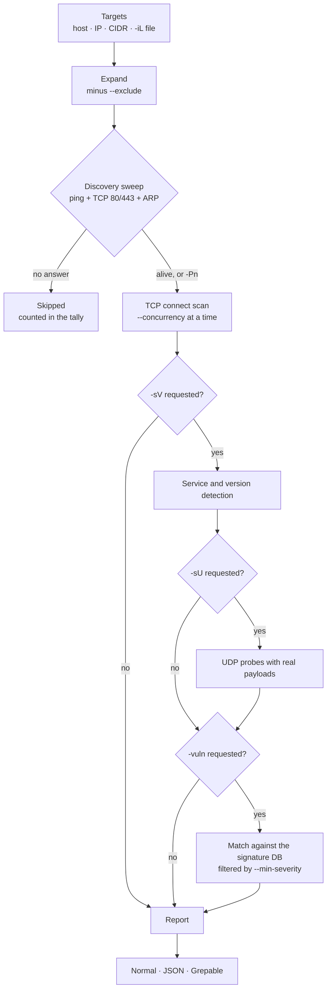
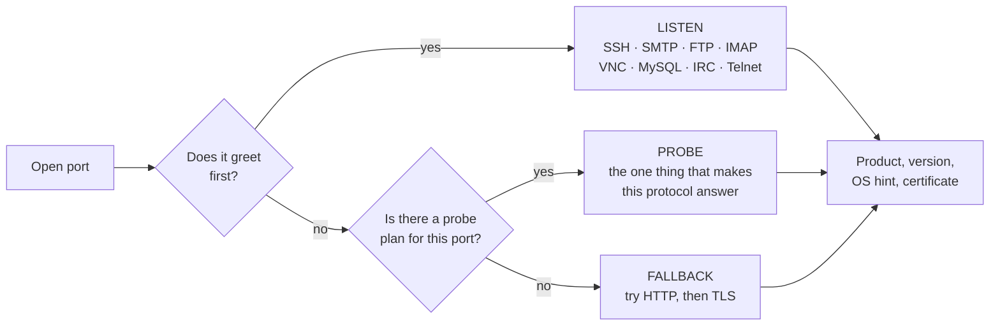

**A port scanner and a DNS toolkit in one binary. No root. No dependencies.**

[Install](#install) · [Uninstall](#uninstall) · [Quick start](#quick-start) · [Commands](#command-reference) ·
[How it works](#how-a-scan-runs) · [Encrypted DNS](#encrypted-dns) ·
[Español](README.es.md)

</div>

---

Kaisen is a single self-contained binary you install once and run from anywhere
(`kaisen`, `kai`, or `kaison`). It combines high-speed **port scanning**,
**service and version detection**, **best-effort OS inference**, a **vulnerability
signature matcher**, and a complete **DNS resolver** — a `dig` replacement that
also speaks encrypted DNS — on an async engine that scans thousands of ports at
once.


---

## ▍Why Kaisen

<dl>

<dt>Fast, without asking for privileges</dt>
<dd>Rust and <code>tokio</code> push thousands of simultaneous connections. A full
65,535-port sweep of a local host finishes in a couple of seconds.</dd>

<dt>Two tools in one</dt>
<dd>Port and service scanning <em>and</em> DNS resolution, with the flags you
already know from <code>nmap</code> and <code>dig</code>.</dd>

<dt>Written from scratch, top to bottom</dt>
<dd>The DNS engine, the TLS prober, the TLS 1.3 client, the WHOIS client and
every protocol probe are implemented here. The only dependencies are
<code>tokio</code> and <code>futures</code>. Port datasets (800+ named ports) and
the vulnerability database are embedded in the binary.</dd>

<dt>Honest about its limits</dt>
<dd>Where an unprivileged tool cannot know something, Kaisen says so at runtime
rather than guessing and presenting the guess as fact.</dd>

</dl>

---

## ▍Install

**Linux / macOS / Termux**
```sh
curl -fsSL https://raw.githubusercontent.com/nostraxiten/kaisen/main/install.sh | sh
```

**Windows (PowerShell)**
```powershell
irm https://raw.githubusercontent.com/nostraxiten/kaisen/main/install.ps1 | iex
```

> [!IMPORTANT]
> **Windows compilation requires MSVC C++ Build Tools.** If the compilation fails with a `linker link.exe not found` error, run the following command in PowerShell as Administrator to install it:
> ```powershell
> winget install Microsoft.VisualStudio.2022.BuildTools --custom "--add Microsoft.VisualStudio.Workload.VCTools --includeRecommended"
> ```
> Afterward, restart your PowerShell session and run the installation script again.

The installer detects your system, installs a Rust toolchain if needed, builds
the release binary, and drops `kaisen` / `kai` / `kaison` into a directory on
your `PATH` — preferring a user-writable one, so **no admin/sudo** is required.

<details>
<summary><b>Termux, from source, and other platforms</b></summary>

<br>

**Termux (unrooted)**

```sh
pkg install -y git rust
git clone https://github.com/nostraxiten/kaisen
cd kaisen && ./install.sh
```

**From source, any OS**

```sh
git clone https://github.com/nostraxiten/kaisen
cd kaisen
cargo build --release
# binary at target/release/kaisen
```

Tested on Windows, Termux (unrooted), Kali, Debian/Ubuntu, Arch, Fedora, Alpine and
macOS. Release builds are published for Linux x86-64/aarch64 (musl), Android
aarch64, and macOS Intel/Apple Silicon.

</details>

### ▍Uninstall & Clean Reinstall

To completely remove any trace of Kaisen (binaries, aliases, build artifacts, temporary files, and caches) for a clean reinstall:

**Linux / macOS / Termux**
```sh
curl -fsSL https://raw.githubusercontent.com/nostraxiten/kaisen/main/delete.sh | sh
```
Or, from a local repository checkout:
```sh
./delete.sh
```

**Windows (PowerShell)**
```powershell
Remove-Item "$env:USERPROFILE\.cargo\bin\kaisen.exe", "$env:USERPROFILE\.cargo\bin\kai.exe", "$env:USERPROFILE\.cargo\bin\kaison.exe" -ErrorAction SilentlyContinue
```

---

## ▍Quick start

```console
$ kaisen -sV 10.0.0.5                    # versions on the top 1000 ports
$ kaisen -A scanme.example.com           # versions + OS + vulnerabilities
$ kaisen -PA --progress 10.0.0.5         # all 65535 ports, watch it advance
$ kaisen -iL hosts.txt --exclude 10.0.0.1    # a list, minus the gateway
$ kaisen -HS -PA --open scanme.example.com   # fastest, only what is open

$ kaisen dns MX example.com @8.8.8.8     # DNS, the dig way
$ kaisen dns +dot A example.com          # the same, encrypted over TLS 1.3
$ kaisen mail paypal.com                 # full email posture audit
$ kaisen ns example.com                  # name server health and exposure
```

> [!TIP]
> `kaisen --help` prints a screenful, not a wall. Ask for one topic at a time:
> `--help scan`, `--help dns`, `--help udp`, `--help timing`, `--help examples`,
> and `--help all` for the complete reference.

---

## ▍How a scan runs

Kaisen is two-phase, like `nmap`: everything gets a cheap liveness check first,
so the expensive port sweep only runs against hosts that actually answered.



---

## ▍Command reference

Every flag below is also in `kaisen --help`, grouped the same way.

<details>
<summary><b>Scan type and host discovery</b></summary>

<br>
<dl>

<dt><code>-sT</code> &nbsp;<sub><code>--connect</code></sub></dt>
<dd>TCP <code>connect()</code> scan. The default, and the reason no root is
needed.</dd>

<dt><code>-sS</code> &nbsp;<sub><code>--syn</code></sub></dt>
<dd>SYN half-open scan. Needs raw sockets; falls back to <code>-sT</code> with a
notice when they are unavailable.</dd>

<dt><code>-sU</code> &nbsp;<sub><code>--udp</code></sub></dt>
<dd>UDP scan with per-protocol payloads. Still no root — see
<a href="#udp-scanning">UDP scanning</a>.</dd>

<dt><code>-Pn</code> &nbsp;<sub><code>--no-ping</code></sub></dt>
<dd>Skip discovery and treat every target as up. Use it when ICMP and ports
80/443 are filtered but you know the host is there.</dd>

</dl>
</details>

<details>
<summary><b>Choosing targets</b></summary>

<br>
<dl>

<dt><code>&lt;target&gt;</code></dt>
<dd>Hostname, IPv4, IPv6, or IPv4 CIDR up to <code>/16</code>. A hostname is
scanned at its primary address.</dd>

<dt><code>-iL &lt;file&gt;</code> &nbsp;<sub><code>--target-file</code></sub></dt>
<dd>Read targets from a file: one per line, <code>#</code> starts a comment,
blank lines are skipped. <code>-</code> reads standard input, so a pipeline can
feed the list straight in.</dd>

<dt><code>--exclude &lt;list&gt;</code></dt>
<dd>Comma-separated hosts, hostnames or CIDRs to leave alone, even when a CIDR
target contains them — the gateway, the printer, an address that is out of
scope. Excluding a hostname removes <em>every</em> address it resolves to.</dd>

<dt><code>--exclude-file &lt;file&gt;</code></dt>
<dd>The same list, read from a file.</dd>

<dt><code>-4</code> / <code>-6</code></dt>
<dd>Force IPv4 or IPv6.</dd>

</dl>
</details>

<details>
<summary><b>Choosing ports</b></summary>

<br>
<dl>

<dt><code>-PF</code> &nbsp;<sub><code>--port-famous</code></sub></dt>
<dd>Top 1000 famous TCP ports. This is the default.</dd>

<dt><code>-PA</code> &nbsp;<sub><code>--ports-all</code> · <code>-p-</code></sub></dt>
<dd>Every TCP port, 1-65535.</dd>

<dt><code>-F</code> &nbsp;<sub><code>--fast</code></sub></dt>
<dd>Top 100 TCP ports.</dd>

<dt><code>-p &lt;spec&gt;</code> &nbsp;<sub><code>--ports</code></sub></dt>
<dd>Explicit list and ranges: <code>-p 22,80,443,8000-8100</code>.</dd>

<dt><code>--top-ports &lt;n&gt;</code></dt>
<dd>Top N famous TCP ports.</dd>

<dt><code>-pU &lt;spec&gt;</code> &nbsp;<sub><code>--udp-ports</code></sub> ·
<code>--top-udp &lt;n&gt;</code></dt>
<dd>Explicit or top-N UDP ports. Either implies <code>-sU</code>; with a bare
<code>-sU</code> the default is the top 40.</dd>

<dt><code>--exclude-ports &lt;spec&gt;</code></dt>
<dd>Remove ports from whatever selection you made — it applies last, so it
subtracts from <code>-p</code>, <code>-PF</code>, <code>-PA</code> and
<code>--top-ports</code> alike, and from the UDP list too. Useful for the ports
that upset fragile equipment.</dd>

</dl>
</details>

<details>
<summary><b>Detection</b></summary>

<br>
<dl>

<dt><code>-sV</code> &nbsp;<sub><code>--service-version</code></sub></dt>
<dd>Identify the service and version on every open port. See
<a href="#service-and-version-detection">how it works</a>.</dd>

<dt><code>-OS</code> &nbsp;<sub><code>--os-detection</code> · <code>-O</code></sub></dt>
<dd>Infer the operating system. Used <em>alone</em> it prints a focused OS report
instead of a port table; combined with a scan it adds an OS line.</dd>

<dt><code>-MC</code> &nbsp;<sub><code>--mac</code></sub></dt>
<dd>MAC address from the local ARP/neighbour cache. Only resolvable for a
directly-connected subnet.</dd>

<dt><code>-DP</code> &nbsp;<sub><code>--device</code></sub></dt>
<dd>Guess the device type: phone, camera, TV, console, printer, NAS, router.</dd>

<dt><code>-WW</code> &nbsp;<sub><code>--webscan</code></sub></dt>
<dd>Web fingerprint on every open HTTP/HTTPS port, <code>whatweb</code>-style but
passive — a handful of GETs, following redirects (apex→www included). Reports
the CMS / framework / server and version (WordPress, Drupal, Next.js, Laravel,
nginx, IIS…), the WAF and CDN in front (Cloudflare, Akamai, Sucuri, Fastly…),
the page title, a security-header grade (HSTS, CSP, X-Frame-Options and three
more, A+…F), and a <b>Shodan-compatible favicon hash</b> you can pivot on.
Implies <code>-sV</code>. Everything lands in <code>-oJ</code> too, under each
port's <code>web</code> object.</dd>

<dt><code>-vuln</code> &nbsp;<sub><code>--vuln</code></sub></dt>
<dd>Match what was found against the embedded signature database.</dd>

<dt><code>-A</code> / <code>-AA</code></dt>
<dd><code>-A</code> is <code>-sV</code> + <code>-OS</code> + <code>-vuln</code>.
<code>-AA</code> adds <code>-sU</code>, <code>-MC</code> and <code>-DP</code> —
slower, because UDP waits on timeouts that TCP never pays.</dd>

<dt><code>-FW</code> &nbsp;<sub><code>--firewall</code></sub></dt>
<dd>Firewall / middlebox pre-check. Before touching the real ports, Kaisen
samples <b>three random high ports</b> (6000–60000). If the host answers
<b>all three</b> <code>open</code>, something is completing every handshake
regardless of what is listening — a firewall or ISP CPE — so any port list
would be fiction: Kaisen stops at once and says so in yellow. If the sampled
ports come back closed or filtered the host is genuinely scannable and the
normal scan runs. <code>-FW</code> is also what turns the "a completed
handshake proves nothing here" warning on — without it Kaisen just reports what
answered and stays out of the way.</dd>

</dl>
</details>

<details>
<summary><b>Timing, speed and progress</b></summary>

<br>
<dl>

<dt><code>-T0</code> … <code>-T5</code></dt>
<dd>Timing template, from paranoid to insane. <code>-T3</code> is the default.</dd>

<dt><code>-HS</code> &nbsp;<sub><code>--hyper-speed</code></sub></dt>
<dd>Maximum concurrency, minimal timeouts.</dd>

<dt><code>--concurrency &lt;n&gt;</code> · <code>--timeout &lt;ms&gt;</code> ·
<code>--retries &lt;n&gt;</code></dt>
<dd>Override individual pieces of the template. An explicit value always wins
over <code>-T</code> and <code>-HS</code>.</dd>

<dt><code>--scan-delay &lt;ms&gt;</code></dt>
<dd>Pause between hosts. Kinder to the network, and quieter against whatever is
watching it.</dd>

<dt><code>--max-rate &lt;n&gt;</code></dt>
<dd>Cap new connections per second (<code>0</code> = unlimited). This is the knob
that keeps a big sweep from overwhelming a home router into dropping every
packet — the failure mode where a reachable host comes back with <b>0 open</b>.
Defaults per template: <code>-T3</code> 50, <code>-T4</code> 150,
<code>-T5</code>/<code>-HS</code> unlimited. Raise it on a fast link, lower it on
a fragile one. <code>-T4</code> and <code>-T5</code> are faster than the default,
but only <code>-T3</code>/<code>-T4</code> stay safe across NAT — <code>-T5</code>
is for a LAN or lab with no stateful firewall in the path.</dd>

<dt><code>--progress</code> · <code>--stats-every &lt;s&gt;</code></dt>
<dd>Set the progress refresh cadence (every two seconds, or every N). You rarely
need this: a live counter (done/total, %, rate, ETA) <b>turns itself on</b> for
any scan that keeps you waiting, in every output format. Use these only to
change how often it refreshes.</dd>

</dl>

> [!TIP]
> Progress is written to **stderr**, and only when stderr is a terminal — so it
> shows in JSON and grepable runs too, while the data on **stdout** stays clean.
> Piping to `jq`, redirecting to a file or running in CI drops it automatically.

</details>

<details>
<summary><b>Output and filtering</b></summary>

<br>
<dl>

<dt><code>--open</code></dt>
<dd>Only show open ports.</dd>

<dt><code>--no-stream</code></dt>
<dd>By default, Kaisen prints each open port <b>live</b> to stderr the moment it
is confirmed — so on a big sweep you read results as they arrive instead of
waiting for the whole scan (<code>OPEN → show → keep scanning</code>). While the
remaining (usually filtered) ports drain, a live <code>done/total · % · rate ·
ETA</code> counter ticks on stderr, so the scan never looks hung. The full,
sorted report still prints at the end. <code>--no-stream</code> turns the live
feed off. Streaming applies to the human-readable output on a terminal only;
JSON and grepable always emit one complete document.</dd>

<dt><code>--reason</code></dt>
<dd>Show why each port is in the state it is: <code>syn-ack</code>,
<code>conn-refused</code>, <code>timeout</code>.</dd>

<dt><code>--min-severity &lt;level&gt;</code></dt>
<dd>Hide <code>-vuln</code> findings below <code>info</code>, <code>low</code>,
<code>medium</code>, <code>high</code> or <code>critical</code>. Detection still
runs in full — this filters the report, JSON included, and a trailing line says
how many findings were hidden.</dd>

<dt><code>--vuln-list</code></dt>
<dd>Print every rule <code>-vuln</code> can fire — signatures, port exposure,
probe conditions — and exit. No network traffic and no target needed. Honours
<code>--min-severity</code>.</dd>

<dt><code>-v</code>, <code>-vv</code>, <code>-vvv</code></dt>
<dd>More detail. <code>-vv</code> expands each vulnerability finding.</dd>

<dt><code>-oN</code> / <code>-oJ</code> / <code>-oG</code></dt>
<dd>Normal, JSON or grepable output.</dd>

<dt><code>--color</code> / <code>--no-color</code></dt>
<dd>Force colour on or off. <code>NO_COLOR</code> is honoured, and colour turns
itself off when the output is not a terminal.</dd>

<dt><code>-h [topic]</code> &nbsp;<sub><code>--help</code></sub></dt>
<dd>The summary, one section, or <code>--help all</code> for everything.</dd>

</dl>
</details>

---

## ▍Service and version detection

`-sV` does not just grab a banner. Kaisen runs a per-port probe plan in three
tiers, cheapest first, and stops as soon as something identifies itself.



Because virtual-hosted servers answer a bare IP with a generic page, Kaisen
sends the name you actually asked for as the HTTP `Host` header and as TLS SNI.

<details>
<summary><b>The protocols Kaisen speaks to get a version</b></summary>

<br>

| Protocol | What comes back |
|---|---|
| **TLS/SSL** | negotiated version, cipher, ALPN, certificate CN, issuer, SAN hostnames, expiry — from a hand-rolled ClientHello |
| **SMB2** | dialect, so a Windows generation, plus the signing policy |
| **MS SQL Server** | the exact build: `15.0.2000` is SQL Server 2019 |
| **MongoDB** | release from `maxWireVersion`, exact version when unauthenticated |
| **Oracle** | `VSNNUM` decoded to `11.2.0.4.0` |
| **PostgreSQL** | TLS support and the authentication method demanded |
| **RDP** | security layer (NLA or not) and the machine hostname from the certificate |
| **AMQP** | `connection.start` properties: RabbitMQ and its exact version |
| **Kafka** | the API map, and from it an approximate broker release |
| **Cassandra** | supported CQL version |
| **LDAP** | AD or OpenLDAP, the DC hostname, naming contexts |
| **DNS** | `version.bind`: BIND, PowerDNS, Unbound or dnsmasq, and the version |
| **MQTT** | broker version, and whether anonymous connects are accepted |
| **X11** | protocol version, vendor, and whether access control is off |
| **epmd** | every registered Erlang node and its distribution port |
| **Minecraft** | server version, protocol, player count |
| **AJP13** | connector reachable — the Ghostcat precondition |
| **SOCKS** | version, and whether it is an open proxy |
| **Redis · memcached · ZooKeeper** | version, and whether auth is enforced |
| **HTTP** | `Server`, `X-Powered-By`, `X-Jenkins`, `<title>`, JSON version APIs |

HTTP detection also fingerprints applications and appliances from headers,
cookies, body markers and certificate names — WordPress, Jenkins, GitLab,
Grafana, Kibana, Proxmox, pfSense, Synology, Home Assistant, MikroTik, printers,
cameras — and reads versions out of the JSON roots of Elasticsearch, etcd,
Docker, Consul, Vault and Kibana.

Behind that sit **1,055 fingerprint rows naming 973 distinct products**, most of
them converted from nmap's `nmap-service-probes` database:

| Table | Rows | What it reads |
|---|---:|---|
| `APP_MARKERS` | 288 | keywords anywhere in the response: cookies (`webvpn=`, `cprelogin=`, `grafana_sess=`), auth realms, body markers, certificate names, telnet login banners |
| `SERVER_ALIASES` | 480 | `Server:` headers whose leading token is *not* the product — `Apache-Coyote/1.1` is Tomcat's connector, `App-webs/` is a Hikvision camera, `Cougar/9.01` is Windows Media Services |
| `SSH_SOFTWARE` | 139 | the software string in `SSH-2.0-…`, for the vendor stacks where splitting on `_` reads wrong |
| `MAIL_PRODUCTS` | 85 | SMTP/POP3/IMAP greetings and capability lists |
| FTP daemons | 63 | the `220` greeting |

Nothing here is a regex sweep: each table is scoped to the one place its
evidence lives (the `Server:` header, the SSH greeting, the 220 line), which is
what lets it be large without inventing products. A server that names itself
correctly — nginx, Apache, IIS, lighttpd, WebSphere, GlassFish — is never
renamed, and a test asserts exactly that.

</details>

```console
$ kaisen -sV example.com
443/tcp  open  https   TLS 1.3 (CN=example.com; issuer=R11; expires 2026-09-06; ALPN=h2)
```

---

## ▍UDP scanning

UDP is where most scanners stop, because there is no handshake to lean on.
Kaisen gets a real answer two ways, both without root.

<dl>

<dt>A reply means open</dt>
<dd>Every port worth scanning gets a payload the service will actually answer —
an NTP client packet, an SNMP GET, a NetBIOS node status, a Steam
<code>A2S_INFO</code>. A generic empty datagram proves nothing; a
protocol-shaped one identifies the service in the same round trip.</dd>

<dt>An ICMP port-unreachable means closed</dt>
<dd>Kaisen never sees the ICMP packet — that needs <code>CAP_NET_RAW</code> — but
a <em>connected</em> UDP socket surfaces it as <code>ConnectionRefused</code> on
the next receive. That is what makes closed and filtered separable with no
privileges at all.</dd>

</dl>

> [!IMPORTANT]
> Silence is reported as `open|filtered`, never as one or the other. A firewall
> drop and a quiet service are genuinely indistinguishable from the outside, and
> Kaisen will not guess between them.

<details>
<summary><b>What the UDP probes bring back</b></summary>

<br>

| Probe | What comes back |
|---|---|
| **NTP**, asked three ways | stratum and reference clock; the daemon's exact version and host OS via mode 6 `readvar`; and `monlist`, whose reply *is* the CVE-2013-5211 finding |
| **NetBIOS** node status | hostname, workgroup, per-name roles, adapter MAC |
| **SQL Server Browser** | every instance with its exact version and TCP port, pre-auth |
| **IPMI** | version, and whether null authentication or anonymous login are permitted |
| **SNMP** v1/v2c/v3 | `sysDescr`, usually the full OS string |
| **EtherNet/IP** | vendor, product name, firmware revision, serial |
| **rpcbind** | every registered RPC program with its version and port |
| Also | DNS, SSDP/UPnP, mDNS, LLMNR, IKE, STUN, CoAP, TFTP, XDMCP, memcached, BACnet, DNP3, RakNet, Steam, Mumble, Ubiquiti, SLP, RIP, OpenVPN |

</details>

```console
$ kaisen -sU 192.168.1.1                  # top 40 UDP ports
$ kaisen -sU -pU 123,161,1900 10.0.0.5    # specific services
$ kaisen -AA 192.168.1.10                 # TCP + UDP + OS + vuln, everything
```

---

## ▍DNS

The `dns` subcommand (also `dig` or `resolve`) is a full resolver, not a wrapper
around the system one. It speaks to the server you name, over the transport you
choose, and shows you what came back.

<details>
<summary><b>Query options</b></summary>

<br>
<dl>

<dt><code>-D &lt;type&gt;</code> &nbsp;<sub><code>--dns</code></sub></dt>
<dd>Record type — or just write it as a bare word, dig-style:
<code>kaisen dns MX example.com</code>. Understands A AAAA NS CNAME SOA PTR MX
TXT SRV CAA NAPTR SVCB HTTPS TLSA SSHFP DS DNSKEY CDS CDNSKEY RRSIG NSEC NSEC3
CERT DNAME URI HINFO LOC KX EUI48 EUI64 ZONEMD OPENPGPKEY SMIMEA AXFR ANY, and
<code>TYPE###</code> for anything else.</dd>

<dt><code>-x &lt;ip&gt;</code> &nbsp;<sub><code>--reverse</code></sub></dt>
<dd>Reverse (PTR) lookup.</dd>

<dt><code>@server</code> · <code>--dns-port &lt;n&gt;</code></dt>
<dd>Ask a specific server, on a specific port.</dd>

<dt><code>+short</code> · <code>+tcp</code> · <code>+ttl</code> · <code>+all</code></dt>
<dd>Answers only; force TCP; show TTLs; also print the authority and additional
sections.</dd>

<dt><code>+dnssec</code> · <code>+nsid</code> · <code>+norec</code></dt>
<dd>Set the DO bit and show RRSIG/DNSKEY; ask which anycast node answered
(RFC 5001); clear RD to ask a server for its own data rather than a recursion.</dd>

<dt><code>+trace</code></dt>
<dd>Resolve iteratively from the root, one delegation hop per block — so a
broken delegation shows up as the hop where the chain stops, not as a bare
SERVFAIL.</dd>

<dt><code>+subnet &lt;cidr&gt;</code></dt>
<dd>EDNS Client Subnet (RFC 7871): ask as if you were on that network, and see
the scope the server used to answer. This is how you watch a CDN split traffic
by region from a single machine. Host bits are cleared before sending, as the
RFC requires.</dd>

</dl>

EDNS0 is advertised by default (1232-byte payload, per DNS Flag Day 2020), with
an automatic retry without it for servers too old to cope. Asking for `AXFR`
performs a zone transfer and reports whether it was allowed.

</details>

### Encrypted DNS

`+dot` sends the query over TLS 1.3 on port 853 (RFC 7858). `--doh` sends it
over HTTPS (RFC 8484). Either way the network you are on cannot read the
question or rewrite the answer.

```console
$ kaisen dns +dot A example.com                    # via one.one.one.one
$ kaisen dns +dot A example.com @dns.google
$ kaisen dns --doh MX example.com                  # via cloudflare-dns.com
$ kaisen dns --doh https://dns.quad9.net/dns-query A example.com
```

The TLS client is written from scratch alongside everything else: X25519 for key
exchange, ChaCha20-Poly1305 or AES-128-GCM for records, SHA-256 throughout. Each
primitive is checked against its published test vectors — FIPS 180-4, RFC 5869,
RFC 7748, RFC 8439 and the NIST GCM suite — before it carries a byte. Key
material comes from `/dev/urandom` and nowhere else.

> [!WARNING]
> **What this does and does not protect against.** The certificate's hostname and
> validity dates are checked, and a mismatch or an expired certificate aborts the
> connection. The **issuer chain is not verified** — that needs RSA and ECDSA
> signature verification plus a bundled root store, which Kaisen does not carry
> yet. So an encrypted query defeats someone reading your traffic, but not
> someone actively impersonating the resolver. Kaisen prints this caveat with
> every encrypted answer rather than leaving you to assume otherwise.

---

## ▍Audits

<details>
<summary><b>Name server audit — <code>kaisen ns &lt;domain&gt;</code></b></summary>

<br>

Ordinary DNS tools answer "what does this name resolve to". This one asks the
questions you only think of when something is broken or exposed — and it asks
each authoritative server **directly**, so the answers describe that server
rather than whatever a resolver has cached.

Per name server: reachability, whether it sets the `AA` flag (a lame delegation
if it does not), its SOA serial, whether it recurses for a stranger (an open
resolver), TCP/53 availability, EDNS support, `version.bind`, and whether it
will hand over the whole zone via AXFR.

Across the set: serial agreement — a mismatch is why "it works for some people"
— network diversity, and whether the DNSSEC chain is complete, including the
dangerous asymmetries like a parent DS with no DNSKEY, which makes validation
*fail* rather than merely be absent.

It also detects when the network you are on is intercepting DNS, and says the
per-server results are unreliable instead of reporting every name server as a
lame open resolver.

</details>

<details>
<summary><b>Email posture — <code>kaisen mail &lt;domain&gt;</code></b></summary>

<br>

Checks **MX** and null-MX, **SPF** including the RFC 7208 ten-lookup budget (the
limit that silently turns a valid-looking record into a PERMERROR as provider
include chains grow), **DMARC** with its `pct`, `sp`, alignment and `rua` tags,
**DKIM** across 78 known selectors, **DANE/TLSA** per MX, a live **STARTTLS**
check against each mail exchanger, **BIMI**, **MTA-STS**, **TLS-RPT** and
**CAA** — then prints a checklist and a pass/warn/problem verdict.

```console
$ kaisen mail github.com
[OK] MX        0 github-com.mail.protection.outlook.com
[OK] DMARC     v=DMARC1; p=quarantine; sp=reject; ...   (good)
[OK] DKIM      selector(s) found: google, selector1, k1, k2
[OK] CAA       issue digicert.com, issue letsencrypt.org, ...
Summary: 4 passed, 2 warning(s), 0 problem(s)
```

</details>

<details>
<summary><b>WHOIS and neighbour recon</b></summary>

<br>

`kaisen whois <domain|ip>` is implemented directly over the WHOIS protocol on
TCP/43 — no external service, no library. It asks IANA which registry owns the
TLD, follows the registrar referral for domains and the RIR referral
(ARIN → RIPE/APNIC/…) for IPs, with a built-in TLD-server fallback. It prints a
summary — registrar, dates, name servers, status, net-range, org, abuse contact
— plus the raw record under `-v`.

`kaisen neighbor <domain>` (also `neig` or `fierce`) resolves the apex, detects
wildcard DNS, brute-forces a built-in list of ~190 common subdomains, then walks
the reverse DNS of the /24s around the discovered IPs to surface neighbouring
hosts. Purely passive DNS.

`kaisen lookup <domain>` prints a full profile — A, AAAA, CNAME, NS, MX, TXT,
SOA and CAA — in one shot.

</details>

---

## ▍Vulnerability signatures

`-vuln` matches whatever `-sV` and `-sU` found against an embedded database of
**337 rules**. It is a triage aid, not a scanner: nothing is exploited, and every
finding is somewhere to look next.

```console
$ kaisen --vuln-list          # the whole database, without touching the network
  version signatures                 131
  CVE range correlations             73
    total carrying a CVE id          166
  TCP port exposure heuristics       85 (129 ports)
  UDP port exposure heuristics       33 (41 ports)
  UDP probe conditions               7
  active checks                      6
  certificate checks                 2
  total rules                        337
```

Version signatures cover the usual suspects — OpenSSH including `regreSSHion`
and Terrapin, Apache, nginx, Tomcat/Ghostcat, Exim, Dovecot, Samba, MySQL,
ProFTPD, vsFTPd — the modern application layer — Jenkins, GitLab, Grafana,
Kibana, Confluence, Zimbra, Zabbix, Cacti, Elasticsearch, Drupal, Joomla,
Magento, ownCloud, Adobe ColdFusion, Apache Struts, WSO2, WebSphere, Webmin,
Rejetto HFS, Node-RED, BIND, dnsmasq, Oracle TNS poisoning — the big-data and
container-management planes (Hadoop YARN, Spark, Flink, NiFi, MinIO, Portainer,
Proxmox) — and the classes that get mass-exploited within days of disclosure:
edge and VPN appliances (Citrix NetScaler, Ivanti Connect Secure, FortiOS,
PAN-OS GlobalProtect, SonicWall, WatchGuard, Zyxel, Check Point, F5 BIG-IP),
managed file transfer (MOVEit, GoAnywhere, CrushFTP, Serv-U), Exchange, and the
hypervisor management planes (vCenter, ESXi).

> [!NOTE]
> A hardened appliance publishes no version at all on an unauthenticated
> request. Rather than guess, Kaisen reports those as *exposure* — "this is
> here, its family has a pre-auth RCE history, go and check the build" — and
> keeps the severity at "verify this", not "you are already compromised". A
> version predicate is only used where the product really does state its
> version.

Exposure heuristics flag services that are dangerous *because they are reachable
at all* — etcd, kubelet, Docker's API, Helm Tiller, SaltStack, Erlang EPMD,
IPMI/BMC, Intel AMT, X11, Android Debug Bridge, LDAP/Kerberos/MSRPC, MySQL and
Oracle databases, the r-services — including the industrial protocols with no
authentication by design: Modbus, DNP3, EtherNet/IP, BACnet, S7 — and the UDP
reflection vectors CLDAP, RADIUS, CoAP and SIP alongside the classics. A handful
of **active checks** go one step further under `-vuln`, speaking a single request
to confirm an unauthenticated Redis, Elasticsearch, Prometheus, Meilisearch or
Spring Boot actuator rather than inferring it from the port.

**CVE correlation** goes one step past the exact-version signatures: a detected
product and version are checked against an embedded table of CVEs whose affected
*range* the version actually falls in, each carrying its CPE and a reference.
The database is compiled into the binary, so this happens entirely offline — a
scan never has to tell a third party which hosts it is looking at. A patched
host comes back clean; only a version inside a documented affected band is
flagged. Alongside libupnp's SSDP overflows, CallStranger and OpenSSH's
regreSSHion range, the table carries the CVEs nmap ships as NSE scripts: BIND
from the LIBRESOLV overflows through Kaminsky to the modern assertion failures,
Apache from Slowloris and killapache to Shellshock's CGI path, Exim, Postfix,
ProFTPD, Samba, PHP-CGI, OpenSSL (Heartbleed, CCS injection, DROWN, Logjam,
POODLE), the Windows SMB bulletins from MS06-025 to EternalBlue, MS12-020 on
RDP, Misfortune Cookie on RomPager, and the application layer of the era —
Drupalgeddon, Joomla 3.7.0, the WordPress REST API, Rails XML injection,
ColdFusion, Zimbra, Webmin and phpMyAdmin.

Where the version is a negotiated dialect rather than a release, the predicate
says so: the SMB bulletins fire on the dialect the affected Windows generation
spoke, POODLE on an actual SSL 3.0 handshake, MS12-020 on an RDP server that
still settles for pre-NLA security. And where a fix is distinguished only by a
letter or a `-P` suffix — OpenSSL 1.0.1f against 1.0.1g, BIND 9.9.7 against
9.9.7-P3 — the entry says that in its own text instead of claiming a precision
a banner cannot give.

**Active checks** confirm the highest-value findings by speaking one request to
the service — never changing its state. Meilisearch is asked for `/indexes`
without a key (public data is exposed if it answers), Redis is sent an
unauthenticated `PING`, a Kubernetes API server is confirmed against `/version`,
and an Ezviz camera's cleartext command port is probed for the missing-auth
class (CVE-2023-48121). These run only under `-vuln`.

**A finding never claims more than it verified.** A port heuristic that names a
specific protocol — AJP/Ghostcat, JMX, the Kubernetes API — is only reported at
its full severity when detection actually confirmed that protocol. When it
cannot (a TLS service sitting on the AJP port, an unidentified service on a JMX
port), the finding is degraded to an `info` lead marked *unverified* rather than
worn as a confirmed result — so a camera on 9010 is no longer flagged as exposed
JMX, and a Chromecast on 8009 is no longer flagged as Ghostcat.

Conditional findings only fire when their condition holds. "RDP without Network
Level Authentication" appears when NLA is actually absent, not on every RDP
port, and MongoDB is only called unauthenticated when `buildInfo` really
answered.

```console
$ kaisen -A --min-severity high 10.0.0.5     # skip the informational noise
$ kaisen --vuln-list --min-severity critical # what would a critical even be?
```

---

## ▍Output

<dl>

<dt>Normal <sub>default</sub></dt>
<dd>Human-readable, coloured, nmap-style report.</dd>

<dt>JSON <sub><code>-oJ</code></sub></dt>
<dd>An array of host objects. Pipe it into <code>jq</code>.</dd>

<dt>Grepable <sub><code>-oG</code></sub></dt>
<dd>One line per host, for <code>grep</code> and <code>awk</code>.</dd>

</dl>

```console
$ kaisen -sV 10.0.0.5 > scan.txt        # overwrite
$ kaisen -OS 10.0.0.5 >> report.txt     # append
$ kaisen -PF -oJ 10.0.0.5 | jq .        # pipe JSON
```

Colour turns off automatically when the output is not a terminal, so saved files
contain clean text with no ANSI codes. The banner, the progress line and every
status message go to stderr, so they never pollute a redirect.

---

## ▍What "no root" means, feature by feature

| Feature | Without root |
|---|---|
| Connect scan `-sT` | full speed, no compromise |
| UDP scan `-sU` | payload probes, plus ICMP-derived `closed` state |
| Service and version `-sV` | banners, protocol probes, TLS certificates |
| DNS, including `+dot` and `--doh` | complete |
| ICMP ping discovery | via the system `ping` binary, unprivileged |
| OS detection `-OS` | multi-signal inference — see below |
| SYN scan `-sS` | falls back to `-sT`, with a notice |

Only `-sS` is degraded, and Kaisen tells you when it degrades rather than
quietly doing less.

<details>
<summary><b>How <code>-OS</code> detects the OS without root</b></summary>

<br>

A raw TCP/IP fingerprint (nmap's `-O`) needs `CAP_NET_RAW`. Instead Kaisen
combines several unprivileged signals and weights them by confidence:

<dl>

<dt>ICMP TTL, via the system <code>ping</code></dt>
<dd>The initial TTL reveals the family — 64 for Linux/Unix/macOS/Android, 128
for Windows, 255 for network gear/BSD/Solaris — along with the hop count.</dd>

<dt>SNMP <code>sysDescr</code> on UDP/161</dt>
<dd>The <em>exact</em> OS string, when the host exposes SNMP.</dd>

<dt>Service banners</dt>
<dd>SSH, HTTP and SMTP version strings that name the distribution, across ~55
platform keywords: Ubuntu, Debian, Rocky, AlmaLinux, Amazon Linux, Alpine, SUSE,
the BSDs, Solaris, AIX, OpenWrt, RouterOS, Synology, VxWorks.</dd>

<dt>Protocol probes</dt>
<dd>An SMB dialect implies a Windows generation; a TDS pre-login means Windows;
an FTP <code>SYST</code> says <code>UNIX</code> or <code>Windows</code> outright.</dd>

<dt>Open-port profile</dt>
<dd>A weak fallback: 445 and 3389 lean Windows, 22 and 631 lean Unix.</dd>

</dl>

Used alone, `kaisen -OS <target>` prints a focused report — OS, confidence, role,
TTL and the exact signals — instead of a port table. Certainty is highest when
the host answers ICMP or exposes SNMP, FTP or identifying banners. When it
exposes none of those, unprivileged detection can only narrow the family, and
Kaisen says so rather than inventing a name.

</details>

> [!NOTE]
> **No root needed.** The core engine uses unprivileged TCP `connect()` scans, so
> Kaisen runs the same on an **unrooted Termux** phone, on **Kali**, on any Linux,
> or on macOS. Features that normally require raw sockets (`-sS` SYN scan, ICMP
> ping, TCP/IP OS fingerprinting) degrade gracefully with a clear notice instead
> of failing.

---

> [!CAUTION]
> Scan only hosts you own or have written authorisation to test. Port scanning
> and zone transfers are logged, noticed, and in many jurisdictions unlawful
> without permission. The `-vuln` findings are leads to verify, not proof of
> anything.

## ▍License

MIT — see [LICENSE](LICENSE).
